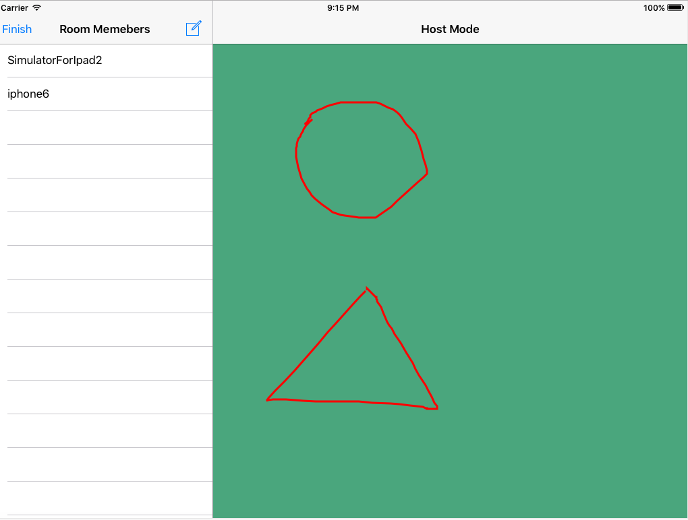

# Work Together
 
## Introduction

Work Together is an iOS app written in Swift with Firebase powered backend.

It is an app that can make people work together locally or remotely.

In Remote mode: 

Team leader (host user) can create a room, tell his teamates roomId

Other team members can join a room by typing in roomID

In the room, host user has the permission to drawing something in the drawing panel,
and it will share his screen to his team members at the same time.

Host User:

Another team member: 

## ToDo
- "Local connection" part is still in progress.
- Some bugs need to fix